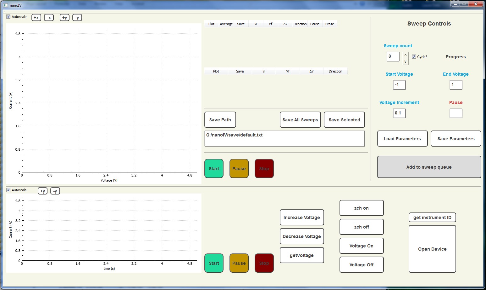

# nanoIV
nanoIV is a GUI application that allows the user to remotely control a Keithley 6487 picoammeter. nanoIV can be used to measure IV curves and take time-series separately or simultaneously.

nanoIV was written in C++ and uses the Qt framework.

## Instructions

### Installation (Windows only)

To install nanoIV on your machine, you'll need to download the following:
- Source code contained in this repository
- [Qt software](www.qt.io/download/)
- National Instruments visa32.dll
- [QCustomPlot](www.qcustomplot.com)

