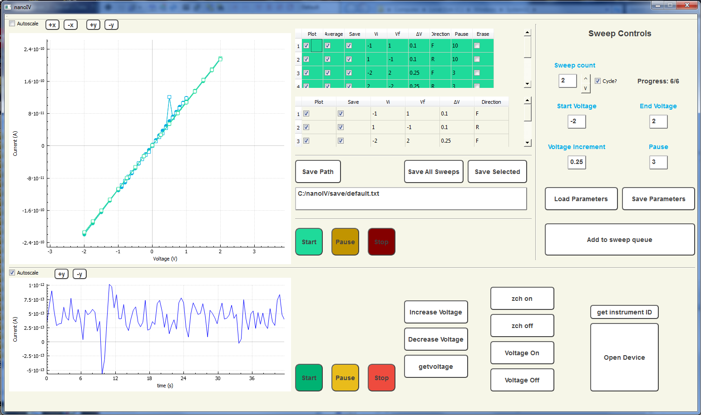

# nanoIV
nanoIV is a GUI application that allows the user to remotely control a Keithley 6487 picoammeter. nanoIV can be used to measure IV curves and take time-series separately or simultaneously.

nanoIV was written in C++ and uses the Qt framework.

## Installation (Windows only)

To install nanoIV on your machine, you'll need to download the following:
- Source code contained in this repository
- [Qt software](www.qt.io/download/)
- National Instruments visa32.dll instrument driver
- [QCustomPlot](www.qcustomplot.com)

After download and installation, compile and run in Qt.

## Features

- Allows full manual control of the picoammeter
- Two measurement modes that can be used separately or simultaneously
	- IV curve
	- Time-series

#### IV Curves
- Queue up multiple IV sweeps with different parameters
- Save any subset of the gathered data
- Change the plot range in real-time to inspect IV curves during acquisition

#### Active current monitoring
- Monitor device current in real-time while an IV curve is running
- Allows saving of the entire acquired time-series

